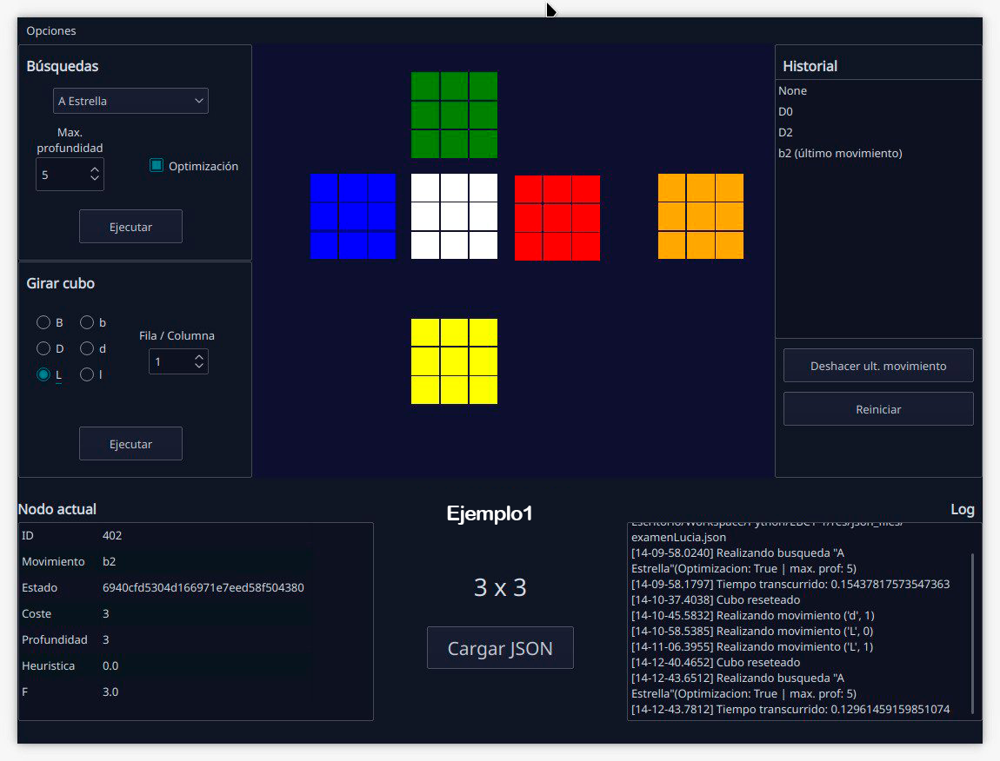

# Rubik solver

Proyecto para resolver un cubo de Rubick utilizando diferentes algoritmos. El formato de entrada sería un JSON con el estado de cada una de las caras.

### Pre-requisitos 📋

- python 3
- flit_core >=2,<3

### Instalación 🔧


_Se instalaría Python y la librería flit-core_

```
sudo apt-get install python3.6
pip install flit-core
```

_Y se ejecuta_

```
main.py
```
_o_
```
main.py terminal
```

## Despliegue 📦

En el caso de que quieras utilizar la interfaz gráfica, tienes que ejecutar el comando sin argumentos. Para ver el programa por terminal, deberías pasarle cualquier argumento y después, seguir las instrucciones que te muestra el programa.

## Construido con 🛠️

* [Python 3](http://www.dropwizard.io/1.0.2/docs/)


## Autores ✒️

_Menciona a todos aquellos que ayudaron a levantar el proyecto desde sus inicios_

* **Eduardo García** - [eduardez](https://github.com/eduardez)
* **Lucía Alfonso** - [luciaagarcia](https://github.com/luciaagarcia)
* **Fernando Ruiz** - [fenriruiz](https://github.com/FenriRuiz)
